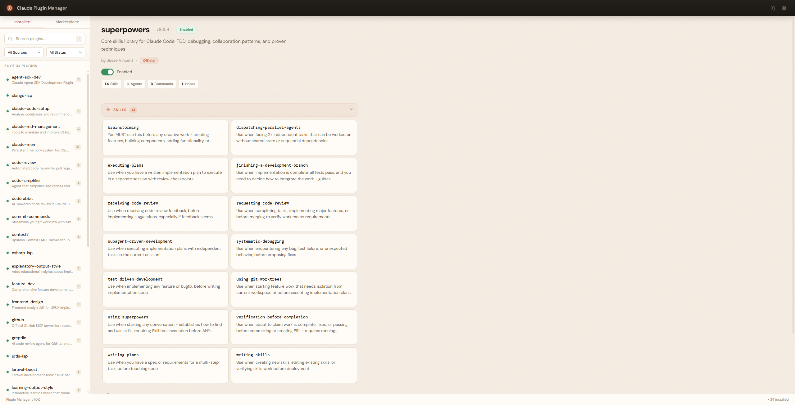
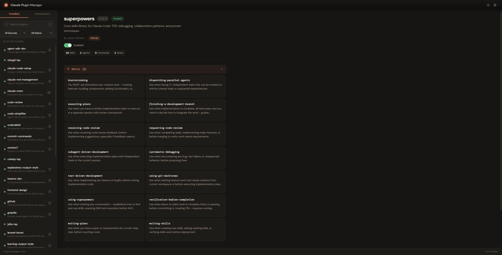
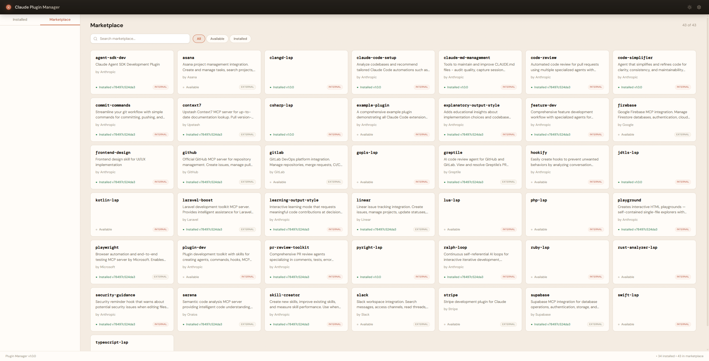

# Claude Plugin Manager

A visual web UI for managing Claude Code plugins. Browse installed plugins, toggle enabled/disabled, search by skills and features, and explore the marketplace — all from a clean, Anthropic-styled interface.

## Features

- **Installed Plugins** — View all 34+ installed plugins with descriptions, skills, agents, commands, hooks, MCP servers, modes, and CLAUDE.md previews
- **Toggle Plugins** — Enable/disable plugins with a single click (changes apply on next Claude Code session)
- **Search & Filter** — Search across plugin names, descriptions, skill names. Filter by source (Official/Community) and status (Enabled/Disabled)
- **Marketplace Browser** — Browse 43+ available plugins from the official marketplace with search and filter pills
- **Card-Based UI** — Skills and agents displayed as expandable cards in a responsive grid
- **Premium Design** — Anthropic-styled with DM Sans font, terracotta accents, smooth animations, dark mode support
- **Standalone Window** — Opens as an Edge/Chrome app window (no browser chrome)
- **Secure** — One-time auth token exchange, cookie-based sessions, Host header validation, CSRF defense, XSS prevention
- **SSE Live Updates** — Automatically refreshes when settings change externally
- **Keyboard Shortcuts** — `/` to search, arrow keys to navigate, Enter to select

## Installation

### From the marketplace (after approval)

In Claude Code, run `/plugin` and search for `plugin-manager`, or:

```
/plugin install plugin-manager
```

### Manual installation (from source)

```bash
git clone https://github.com/DVKolm/claude-plugin-manager.git
cd claude-plugin-manager
npm install
npm run build
```

Then start Claude Code with the plugin loaded:

```bash
claude --plugin-dir ./claude-plugin-manager
```

Run `/reload-plugins` if you make changes during a session.

## Usage

In Claude Code, run:

```
/plugin-manager:open
```

This starts the HTTP server and opens the UI in a standalone window.

## Architecture

- **Skill-only plugin** — no always-on MCP server, zero startup overhead
- **On-demand HTTP server** — starts when needed, auto-exits after 30 min idle
- **Zero runtime dependencies** — only Node.js built-in modules
- **TypeScript backend** — 7 modules (types, frontmatter parser, plugin scanner, router, auth, config, marketplace)
- **Vanilla JS frontend** — no React/Vue/Angular, just HTML + CSS + JS

## Tech Stack

| Layer | Technology |
|---|---|
| Backend | TypeScript, Node.js `http`/`fs`/`crypto` |
| Frontend | Vanilla HTML/CSS/JS |
| Fonts | DM Sans, DM Mono (Google Fonts) |
| Auth | One-time token + HttpOnly cookie |
| Build | `tsc` + file copy |

## Security

- Binds to `127.0.0.1` only (no external access)
- One-time auth token exchange via cookie
- Host header validation (DNS rebinding defense)
- Content-Type enforcement on mutations (CSRF defense)
- All dynamic content via `textContent` (XSS prevention)
- Plugin IDs validated with strict regex (path traversal defense)
- Atomic file writes with backup (corruption prevention)
- Async mutex for concurrent write serialization

## Screenshots

### Installed View
Plugin list with card-based detail panel, toggle switch, expandable skill cards.



### Dark Mode
Full dark theme support — toggles via the sun/moon button in the header.



### Marketplace
Browse 43+ available plugins with search, filter pills (All/Available/Installed), and install status.



## Development

```bash
# Install dependencies
npm install

# Build (TypeScript + copy UI files)
npm run build

# Start server directly
node dist/server.js

# Development: rebuild and restart
npm run build && node dist/server.js
```

## Project Structure

```
claude-plugin-manager/
├── .claude-plugin/plugin.json    # Plugin manifest
├── skills/open/SKILL.md          # /plugin-manager:open skill
├── src/
│   ├── types.ts                  # TypeScript interfaces
│   ├── frontmatter.ts            # YAML frontmatter parser
│   ├── plugin-scanner.ts         # Reads plugin data from filesystem
│   ├── router.ts                 # Lightweight HTTP router
│   ├── auth.ts                   # Token/cookie auth
│   ├── plugin-config.ts          # Atomic settings writes
│   ├── marketplace.ts            # Marketplace directory scanner
│   └── server.ts                 # HTTP server entry point
├── ui/
│   ├── index.html                # SPA shell
│   ├── styles.css                # Anthropic theme (light + dark)
│   └── app.js                    # Frontend logic
├── dist/                         # Compiled output (pre-built)
├── package.json
└── tsconfig.json
```

## License

MIT
